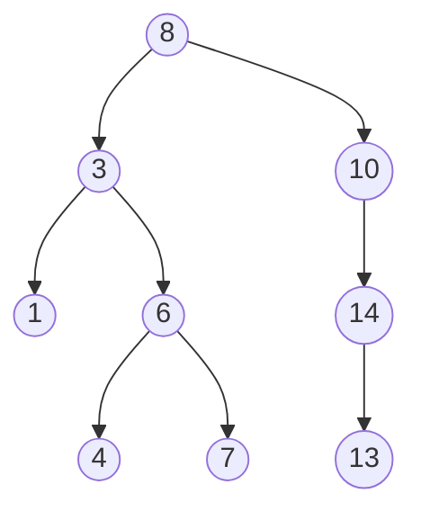

# Binary Search Tree (BST)

_Alias_: sorted/ordered binary tree

> [!definition] Binary Search Tree

> A BST is a rooted binary tree DS (a DS tree where each node contains
> only two edges, and all edges can be traced back to the root).
> In a BST, the key of each internal node (2) is greater than all the
> keys on its left (1), and less than all the keys on its right (3).

Big Theta: O(log N)
Big O time for operations: O(n)
Big O space: O(n)
Components: Nodes, Root, Subtrees, Edges
Basic operations: search, traversal, insert, delete

## BST in JS

The BST implemented in JS is a linked list where each node has:

1. A value;
2. One left subtree object;
3. One right subtree object.
