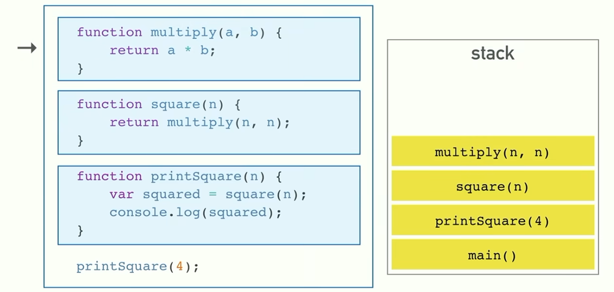
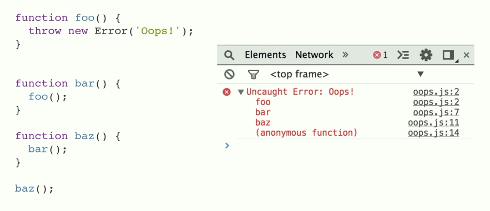
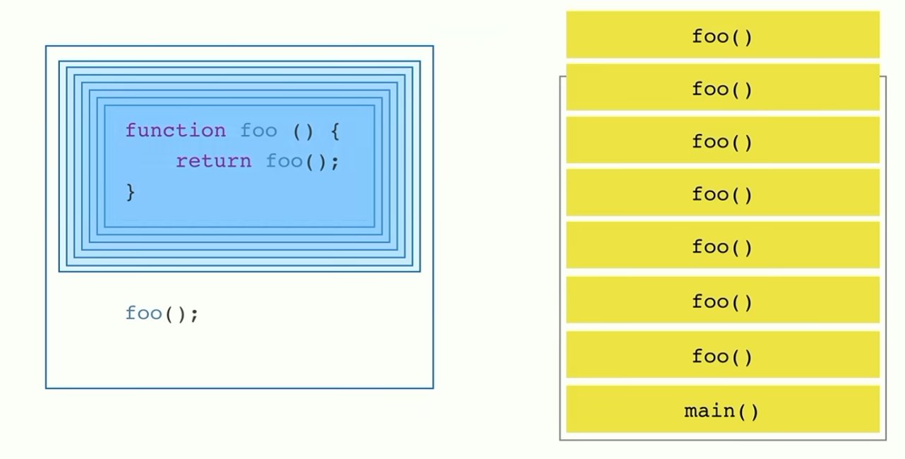
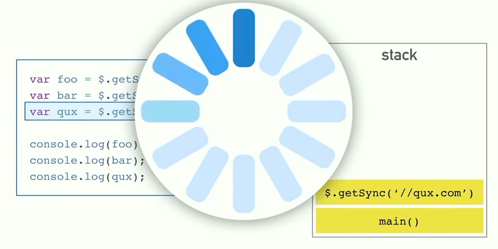
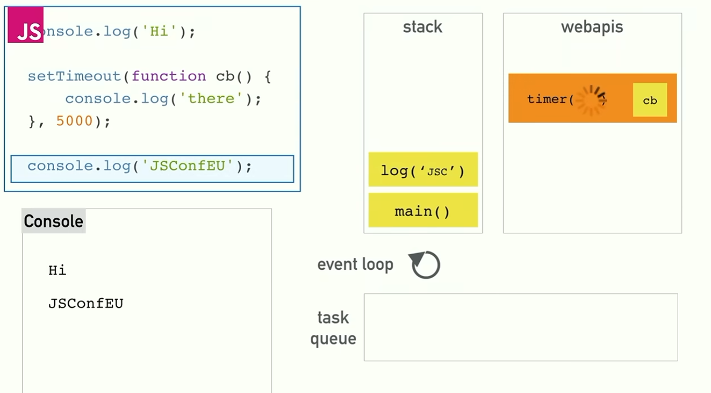
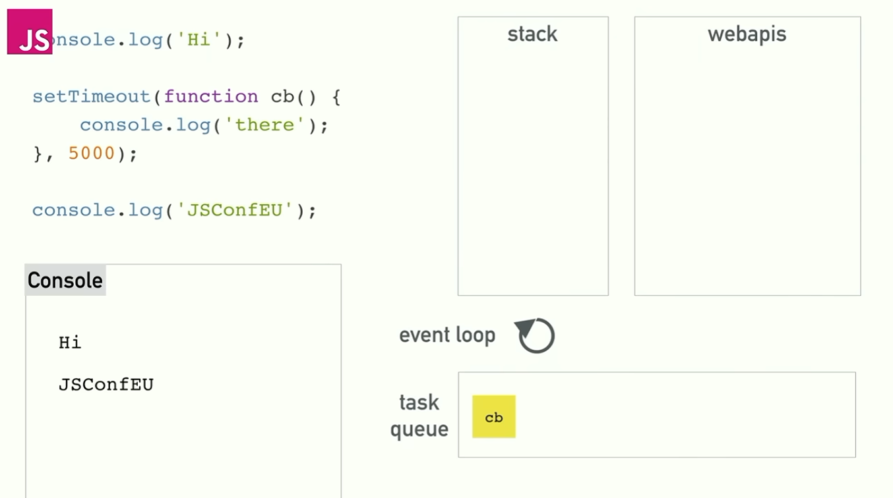
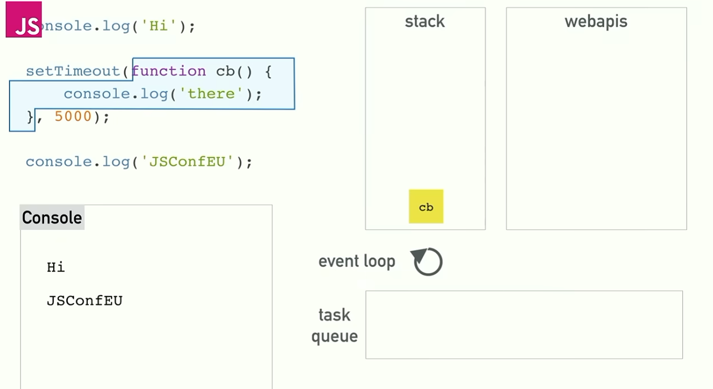
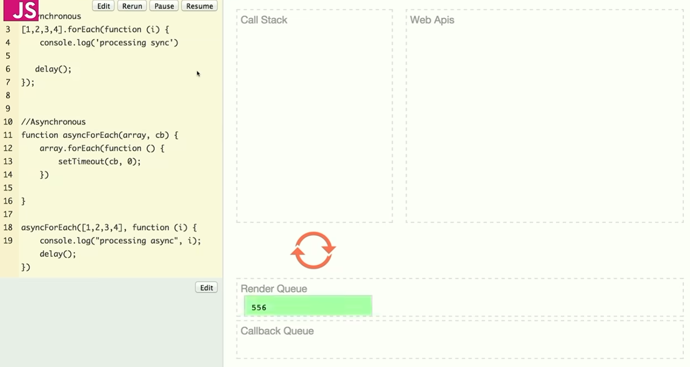

## Blocking the Call Stack in Single Threaded Programming Language

JS is a single-threaded programming language. 
Which means it has a SINGLE CALL STACK,
Which means it runs one line of code at a time.



The top level stack is the main() stack which called subsequent 
stacks based on the call nesting. When a stack returns, it pops off the
call stack. At the end, everything returns to the main().



When a stack encounters an error, we'll be able to see in the dev tool
the call stack sequence where this issue originates---the state of the
state where that error happens. Great!



The term *blowing the stack* refers to when the browser senses that a 
stack is called too many times and decides to kill the stacks for you.
(But notice you can use this recursive stack calling instead of using
a for or while loop).



The term *blocking the stack* refers to when a certain call stack is 
blocking the rest of the code execution due to some wait time. 

This is what happens in a single-threaded programming language; 
single thread execution encountering wait time will... wait.
This waiting is synonymous to blocking the call stack and browser would
just freeze until that blocking stacks returns.


## The Solution: Asynchronous Callback

So setTimeout() is actually an async API that utilizes concurrency.
Run the code below to find that when using async JS break the line-by-
line execution order as appear in the code.

```js
// Call stack completion
console.log('first'); // first

setTimeout(() => {
    console.log('last'); // last
}, 1000)

console.log('second'); // second
```

Here's what's happening under-the-hood:

> Call stack => WebAPI => Task Queue => (gets looped back into the Callback by event loop) => Call stack



setTimeout() is handed off to the browser, which runs webAPIs that
handles the countdown and the callback.



When the webAPI work is done with the callback, it pushes the callback 
onto the Task Queue.

### Event Loop



The Event Loop is the thing that looks into the Task Queue and loop the
the callback back to the Call Stack (LIFO), ONCE THE CALL STACK CLEARS.

~~ The interesting thing about the Event Loop is that:
> Event loop waits until the call stack is clear and done running EVERYTHING. 

So if there are 4 setTimeout(1sec), 
Call stack gets to send them all to WebAPIs first.
WebAPIs process condition and queue the callbacks into the Task Queue.
Event loop will only trigger once Call Stack finishes sending everything. 

So if each of the 4 setTimeout() takes 1 sec to send, 
Call stack would take 4 secs to send them to WebAPIs.
WebAPIs would wait for another 1sec (per arg) for each setTimeout,
taking another 4 secs, before queuing them in the Queue.
And so the event loop would also run synchronously to send callback back
into the stack.
> The set amount of setTimeout() is actually the minimum time taken
because the waiting time queues and each queue processes synchronously. 


## Render Queue



Event Loop has a rate of refresh and its called Render Queue.
When the event loop triggers (once the Stack clears), the rate in which
the queued callbacks get looped back into the Stack is determined by 
this refresh rate --- Render Queue. 

The Render queue is part of the Event loop. So just like the event loop,
it just freezes when the Stack runs and queues things up. 
Only when the stack clears would it resume refreshing.


