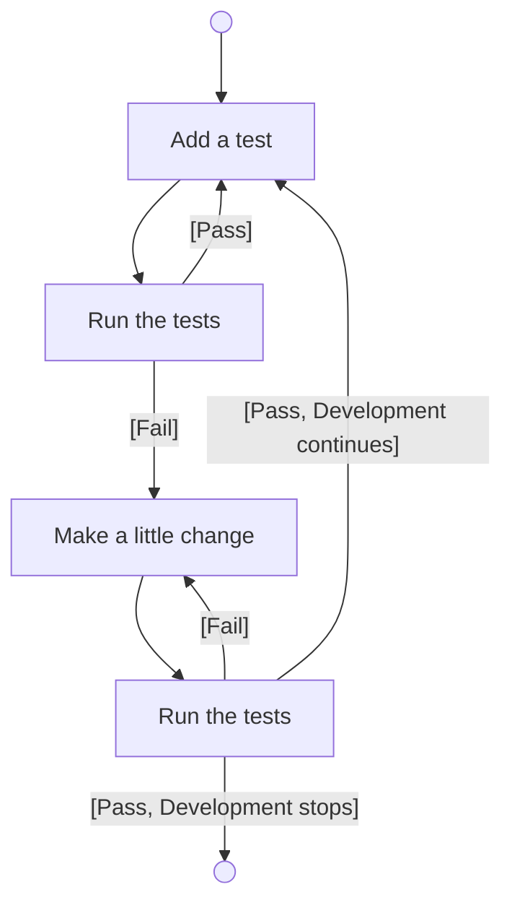

# Test Driven Development (TDD)

TDD is a writing an automatice tests for your code before writing the
code itself.

A few systems for running tests: Mocha, Jasmin, Tape, and Jest
The basic syntax of these are almost identical, they defer in features.

TOP picks Jest for being an accessible resource for explanation and
documentation. What's more important than syntax and features is
understanding TDD philosophy.

## The emphasis and goal of TDD

source: https://web.archive.org/web/20211123190134/http://godswillokwara.com/index.php/2016/09/09/the-importance-of-test-driven-development/

TDD **emphasizes** test-first or requirement-first development:

1. Quickly write a test (for a requirement)
2. Write just enough code to fail the test
3. Refactor code later to pass the test

The goal is **specification** and not validation,
meaning that TDD makes you think through your **requirements** before you
write the functional code.

It is both important as requirement-thinking tool and a design technique.

## The benefits of TDD

- Minimize debugging time (by microtests)
- Maintain focus
- Improve communication (thru requirements)
- Living specification
- Helps slow down thinking
- Every test is a safety net
- Achieve loosely-coupled design
- Encourages refactoring
