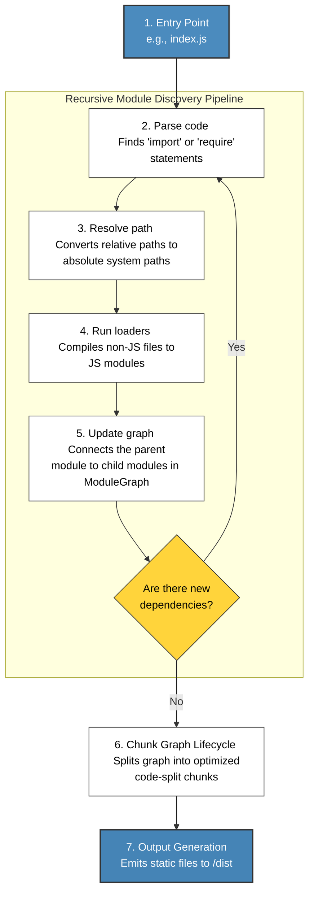

# Webpack

## What is Webpack actually?

Webpack is a *static module bundler* for modern JS apps.
When it processes an app, it internally builds a *dependency graph* from
one or more *entry points* and then combines every module the project 
needs into on or more *bundles*. 

Read more in Webpack's docs here




## Core concepts

Let's review the high-level overview of these concepts: 

* Entry
* Output
* Loaders
* Plugins
* Mode
* Browser compatibility


### Entry

An entry point tells Webpack which module it should use to begin 
building the dependency graph. Webpack could figure out which modules
and libraries that entry point depends on.

Its default value is:

```js
export default {
    entry:  `./src/index.js`,
}
```

Webpack will throw an error if the dir or the file is not found.
If it does this, it will point to the parent dir, saying `Can't resolve`
for the parent dir.


### Output

`Output` tells the Webpack where to export the bundled code to and how
to name these files.

It defaults to `./dist/main.js` for the main output and to the `./dist`
dir for any other generated files. Respectively:


```js
export default {
    output: {
        filename: "main.js",
        path: path.resolve(import.meta.dirname, "dist"),
        // Clean: Toggles Webpack to replace old with new exports 
        // everytime it bundles
        clean: true,
    },
}
```

### Loaders 

Out of the box, Webpack only udnerstand JS and JSON files.
Loaders allow webpack to process other types of files and **convert** 
them into valid *modules* that can be consumed by the application and 
then added to the dependency graph. 

Loaders are configured in `module.rules` and there are two main 
properties: 
* `test` looks for which file or files should be converted
* `use` selects which loader should handle the conversion

```js
export default {
    module: {
        rules: [
            { test: /\.css$/, use: "style-loader", "css-loader" },
        ],
    },
}
```

This essentially says: 'Hey webpack, if you come across a .css file that
resolves from a `require()` or `import` statement, use the 
`style-loader` and `css-loader` (sequence specific) to convert it into
a string then load the code onto the bundle.'


### Plugins

Whereas loaders are used to convert non-JS files into JS modules, 
plugins handle other tasks like optimzing bundle, managing assets, and
env vars. 

Plugins' configs are in the `plugins` array as follows:

```js
export default {
    plugins: [
        // Create a new instance of a plugin for each configurations
        new HtmlWebpackPlugin({
            // Plugins can have different configs
            template: "./src/template.html",
        }),
    ],
}
```

### Mode 

Mode can be set to either `development`, `production` (default), or
`none` to enable Webpack's built-in optimizations for each env. 

```js
export default {
//   mode: "production",
  mode: "development",
//   mode: "none",
};
```

### Browser compatibility

Webpack supports all browsers that are ES5-complaint (IE8 and below are
not supported).
